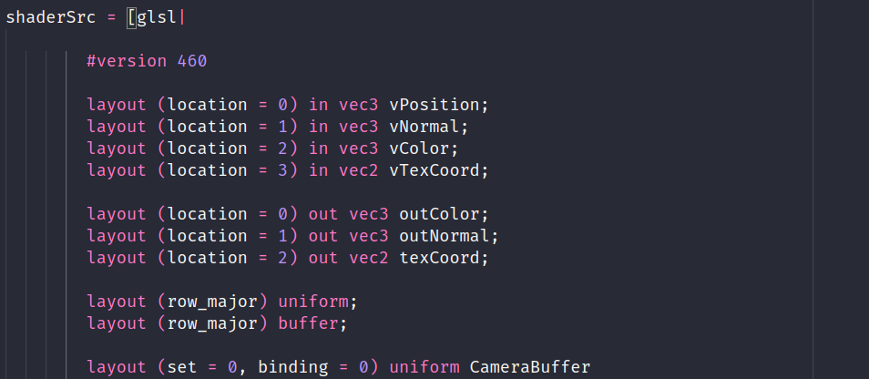

# haskell-shader-qq README

Provides GLSL syntax highlighting for shader QuasiQuotes in Haskell. Intended for use with the [vulkan](https://github.com/expipiplus1/vulkan)
package.

## Features

- Highlights GLSL and HLSL quasiquotes

## Requirements

Visual Studio Code v1.17.0

## Known Issues

- Only supports `glsl` and `hlsl` quasiquoters: `frag`, `vert`, etc. are not supported right now.

## Release Notes

### 0.0.1

Initial release
